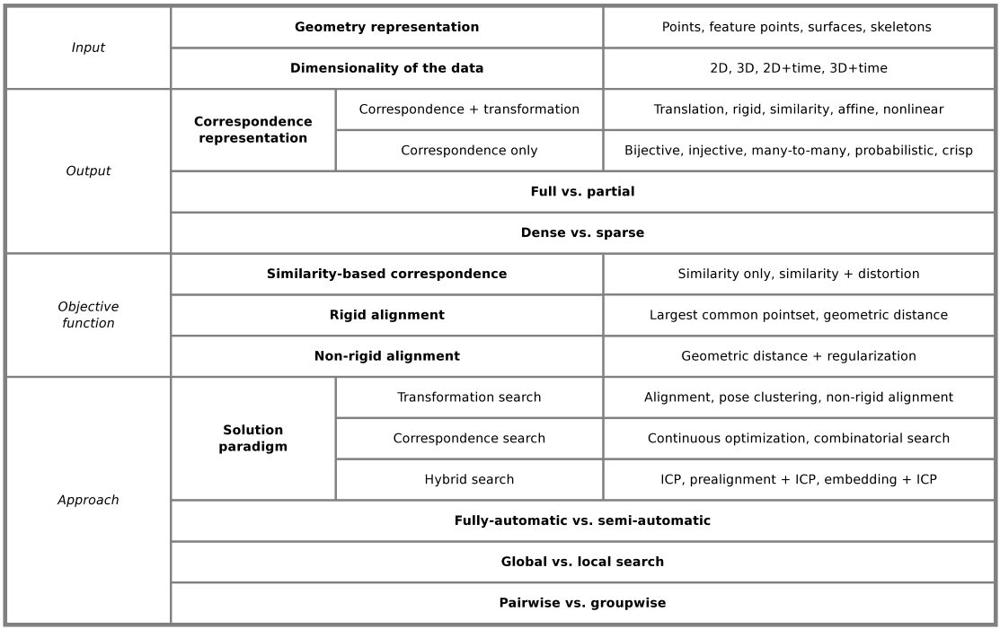

## A Survey on Shape Correspondence

### MetaData
##### Url
https://onlinelibrary.wiley.com/doi/abs/10.1111/j.1467-8659.2011.01884.x

##### Type
review 


#### Domain
CS
##### Keywords 
shape, geometry, computer graphics, graphics, translation

##### Cite
e.g. BibLatex
```LaTeX
@article{VanKaick,
abstract = {We review methods designed to compute correspondences between geometric shapes represented by triangle meshes, contours, or point sets. This survey is motivated in part by recent developments in space-time registration, where one seeks a correspondence between non-rigid and time-varying surfaces, and semantic shape analysis, which underlines a recent trend to incorporate shape understanding into the analysis pipeline. Establishing a meaningful correspondence between shapes is often difficult since it generally requires an understanding of the structure of the shapes at both the local and global levels, and sometimes the functionality of the shape parts as well. Despite its inherent complexity, shape correspondence is a recurrent problem and an essential component of numerous geometry processing applications. In this survey, we discuss the different forms of the correspondence problem and review the main solution methods, aided by several classification criteria arising from the problem definition. The main categories of classification are defined in terms of the input and output representation, objective function, and solution approach. We conclude the survey by discussing open problems and future perspectives.},
author = {{Van Kaick}, Oliver and Zhang, Hao and Hamarneh, Ghassan and Cohen-Or, Daniel},
pages = {1--24},
title = {{A Survey on Shape Correspondence}},
volume = {xx}
}
```

## Content
#### 0. Research Question

Shape Correspondence:

Let $S = {S_i \vert i : 1..N}$ be a set of input shapes. Define relation R between elements of the sets.

$(p, q) \in R \vert p \in S_i \land q \in S_j \land i \neq j$

Shape is composed of elements (points, features), seek correspondence relation between shapes.

#### 1. Contribution
Overview and classification of the field.

#### 2. Method
##### Query/Retrieval versus Correspondence
Given q, find most similar shapes (query), correspondence finds exact matches.
##### 2.1 Tasks
* Full versus partial : similar to graph-subgraph matching
* Sparse vs Dense : e.g. only look at gradient points vs all points
* Grouped: R(p,q,r,z,...) allows for detection of common features
##### 2.2 Challenges



###### 2.2.1 Transformations
* Rigid Transformation: preserves point wise distances (rot, refl, trans)
* Conformal (angle preserving)
* Mobius-Homograph: RT & C
* Non Linear

###### 2.2.2 Objective Functions
O(correspondence) --> R

###### 2.2.3 Similarity based
O(p, q, R) = Sim(p, q, R) + a Distor(p,q, R)

p, q shapes, R correspondence, a weight of distortion (transformation).

Distortion typical = Distance (pointwise): euclidean, geodesic

###### 2.2.4 Rigid alignment
* Largest Common Pointset
* Chamfer (one-way)
* Iterated Closest Point (ICP) uses Chamfer. Additional rotation terms etc are optional.
###### 2.2.5 Non-Rigid alignment
* Penalize quantified loss of semantics by transformation

###### 2.2.6 Search
Global v Local.

###### 2.2.7 Automated
Fully automatic or with user intervening.

###### 2.2.8 Pairwise / Groupwise
In pairwise we're interested in R(p,q), in groupwise we want to identify groups/classes G for which holds that $ (p,q) \in R \vert \forall p,q in G$

##### 2.3 Methods
###### 2.3.1 Transformation/Alignment search
Search for transformation to align shapes, then find correspondence between aligned elements (by proximity).

1. Rigid Alignment:

    1.1 Randomized sampling (pick 3 out of m, transform, test)
    
    1.2 Coplanar points (invariant) 
    
    1.3 Sample and vote: Sample, build table indexed by parameters, and pick best
    
    1.4 Geometric hashing: Sample, vote with prebuilt table of geometric transformations
    
    1.5 Piecewise Rigid Alignment: Divide and conquer, find transformations between parts of elements
    

2. Non Rigid

    2.1 Per (pair of) vertex in shape, find non linear transformation, with regularization term that minimizes difference between transformations
    
    2.2 SVM (learning kernel mapping class to class)
    
    2.3 Hybrid: Rigid best effort to align shapes, then non rigid to align vertices
    
    2.4 Image registration methods: View vertices as pixels/voxels and use registration methods. (expensive)  

###### 2.3.2 Correspondence search
$argmin_R O(p, q, R) = Sim(p, q, R) + a Distor(p, q, R) $

* a = 0: Sim is linear, with a = 0 then it is [Linear Assignment Problem](https://en.wikipedia.org/wiki/Assignment_problem)
Solved by simplex method, or if 1-1 mapping is needed Hungarian algorithm.
* a != 0: 
    * QAP, NP-Hard for deterministic
    * Approximations : [Spectral Clustering](https://ieeexplore.ieee.org/document/1544893/), Relaxation Labeling

* 2D Contour based correspondence for images.

* Tree based search:
    * Node is partial solution
    * Complete solution is path to leaf
    * Evaluation of paths root to leaf renders final solution
    * Node expansion is generating new partials based on prior partials
    * Branch & Bound/ Priority search 
    * Skeleton / Graph to Tree search
    
 ###### 2.3.3 ICP
 2 Stage iterative
 * Stage 1 : Find Align (using correspondence)
 * Stage 2 : Find Correspond (update correspondence)
 
 Biased to initial assignment, preferably done with [PCA based alignment](https://ieeexplore.ieee.org/document/924423)
 
 
###### 2.3.4 Embeddings
Embed shapes in a space s.t. problem becomes one of rigid. Transformation to new space must maintain geometry.

Techniques:
* [MultiDimensionalScaling](https://link.springer.com/article/10.1007/s11263-008-0147-3)
* [Spectral Transform](https://ieeexplore.ieee.org/document/5540178/)
* [Laplace-Betrami](https://dl.acm.org/citation.cfm?id=1282022)
* [Review](https://onlinelibrary.wiley.com/doi/abs/10.1111/j.1467-8659.2010.01655.x)

###### 2.3.5 Graph based

Graph Isomorphism, with partial matching subgraph isomorphsim (NP Complete).

* [Skeleton Matching](https://www.sciencedirect.com/science/article/pii/S0010448506001345)

###### 2.4 Validation
Visual (qualitative) Versus Quantative

Usage of objective function. Uses assumption of accuracy of retrieval == accuracy of computed correspondence.
Usage of statistical modelling. Again, accuracy does not (necessarily) imply a better model.

Ground truth is best measure.
* Hamming loss (cardinality of unmatched points)
* MSE mismatched points
* Statistics on mismatched points (error map)

###### 2.5 Applications

* Statistical Shape Modelling: Model describes acceptable variation
* Retrieval (Recognition): R(p,q) with p unknown, q known.
* Change detection


#### 3. Related Work
N/A

#### 4. Data

Challenge datasets

[SHREC](https://www.itl.nist.gov/iad/vug/sharp/contest/2010/NonRigidShapes)

#### 5. Evaluation
N/A

#### Conclusion
Succinct summary

#### Notes
Rigid Transformation: preserves point wise distances (rot, refl, trans)

#### Extra References and links
1. [Quadratic Programming](https://en.wikipedia.org/wiki/Quadratic_programming)

