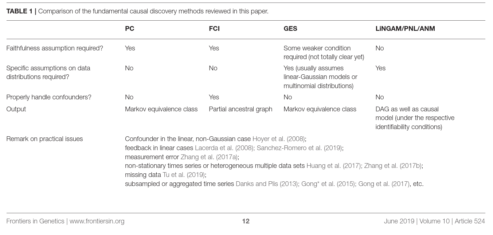

## Title
Review of Causal Discovery Methods Based on Graphical Models
### MetaData
##### Url
https://www.frontiersin.org/articles/10.3389/fgene.2019.00524/full

##### Type
review

##### Domain
Statistics, Mathematics

##### Keywords
causality, statistics, graphical model


##### Cite
e.g. BibLatex
```LaTex

@article{glymourReviewCausalDiscovery2019,
  title = {Review of {{Causal Discovery Methods Based}} on {{Graphical Models}}},
  author = {Glymour, Clark and Zhang, Kun and Spirtes, Peter},
  date = {2019},
  journaltitle = {Frontiers in Genetics},
  shortjournal = {Front. Genet.},
  volume = {10},
  publisher = {{Frontiers}},
  issn = {1664-8021},
  doi = {10.3389/fgene.2019.00524},
  url = {https://www.frontiersin.org/articles/10.3389/fgene.2019.00524/full},
  urldate = {2020-09-07},
  abstract = {A fundamental task in various disciplines of science, including biology, is to find underlying causal relations and make use of them. Causal relations can be seen if interventions are properly applied; however, in many cases they are difficult or even impossible to conduct. It is then necessary to discover causal relations by analyzing statistical properties of purely observational data, which is known as causal discovery or causal structure search. This paper aims to give a introduction to and a brief review of the computational methods for causal discovery that were developed in the past three decades, including constraint-based and score-based methods and those based on functional causal models, supplemented by some illustrations and applications.},
  file = {/home/bcardoen/Zotero/storage/YAAJNAMB/Glymour et al. - 2019 - Review of Causal Discovery Methods Based on Graphi.pdf},
  keywords = {causal,causal discovery,causality,Conditional independence,Directed graphical causal models,graphs,non-Gaussian distribution,Non-linear models,Statistical independence,statistics,Structural Equation Models},
  langid = {english}
}

```
## Content
#### Research Question
Automated construction of graphical models (directed, acyclic) of causality between random variables.

#### Contribution
Reveal causal information from purely observational or experimental data, with focus on continuous data.

#### Definitions
##### Causality
Let X, Y be random variables.
* Necessary causality
  * $x \rightarrow_{N} y$
  * If y, then x must have occurred
  * X can occur without y
  * $y \Rightarrow x$
* Sufficient causality
  * $x \rightarrow_{S} y$
  * $x \Rightarrow y$
  * If x, then y. However, other causes can cause y, therefore y does not require y.
* Necessary and sufficient
  * $x \Leftrightarrow y$
* Contributory cause
  * x is a set of causes that together causes y. x does not need to be necessary nor sufficient
* Conditional vs causality
  * Causality requires temporal order (X occurs before or at same time as Y)
* Probabilistic causation
  * $x \rightarrow y$ , if there is some y where x is not present, then causality does not hold (x=war, y=deaths)
  * More nuanced models P[A|B] > P[A], the presence of B increases likelihood of A

#### Directed Graphical Causal Model
* Given variables $X_i$,
* **edge** $X_i \rightarrow X_j$, if $X_k, k \neq i,j$ are kept fixed, $\exists X_i $ $cov(X_i, X_j) > 0$.
* joint probability distribution over the possible values of all the variables
* DGCM is superset of regression, SEM, factor models, ARM time series models, latent class,
* Do not require initial condition in contrast to partial differential equations
* Constraint: X is **d-separated**, then X is conditionally independent in distribution (similar to Markov, where independence on non-parent variables)
* Graphs with same **d-separated** properties are called **Markov-equivalent (ME)**, $\mathrm{G}=\{ ME(G_i, G_j) | \forall G_i, G_j \in \mathrm{G}\}$, then $\mathrm{G}$ is a **Markov Equivalence Class**, if this assumption exists: **Causal Markov Assumption**
* **path** <$X_i$...> , $\exists X_i \rightarrow X_j$ (or vice versa), directed when there is 1 direction
* **collider** : path with $X_i \rightarrow X_{i+1} \leftarrow X_{i+2}$, $X_{i+1}$ is a common effect
* **Conditional Faithfullness Assumption** : there exists no conditional indepence relations other than encoded by the graph
* Output is a matrix A of NxN ($\vert X  \vert$=N), where A[i,j] = {**p**arent (i$ \rightarrow $ j), **u**known (not known to be absent), **c**onfounded}

#### Differences with statistical estimation
* Statistical estimation has several desired properties:
  * Statistical consistency : under sampling assumptions estimates converge to true value
  * uniform convergence: probabilistic bounds on errors at finite sample sizes
* GCM
  * Pointwise consistency: no finite sample error probs or confidence intervals

#### Types of GVM algorithms
##### Conditional independence based
- Constraint based (requires Faithfullness , large sample size for conditional dependence to work)
* Use conditional independence tests to reconstruct graph
  * Bottom up: (empty to pruned) Greedy Equivalency Search, can't deal with confounders
  * Top Down: (complete -> pruned) FC, FCI
  * Hybrid : GFCI (complete supergraph, then prune)
* Assumes Faithfullness
* Does not work for small samples
* Does not work for paired variables (X-Y), due to no conditional independence test possible

##### Cramer's decomposition theorem and Gaussian variables
Cramer (1970) showed that if sum of Gaussian is Gaussian, then summands must be Gaussian. For Y=f(X) + e this means that there exists assymetry if and only if one summand is not Gaussian. This assymetry can be used to detect causality, because $X \perp \!\!\! \perp  \epsilon$, yet $Y \neg \perp \!\!\! \perp  (bX + \epsilon)$

##### Structural Equation Models (Causality tests)
Given Y, X find if Y is cause, effect or neither. (find edge direction between X,Y)
* Causality tests cannot work under the linear Gaussian model (see Cramer)
###### Linear Non-Gaussian (LINGAM)
$ Y = b(X + \epsilon$
- X or $\epsilon$ is Gaussian, not both
- $f_2$ is linear, $f_1$ is identity
- $X \perp \!\!\! \perp  \epsilon$
- LINGAM (Shimizu et al 2006)
- Can be used with confounders
###### Non-linear
- Post non-linear **PNL**
- $Y \leftarrow f_1(f_2(X) + \epsilon) $
- $f_1$ : non linear, observation error
- $f_2$ : non linear
- PNL is most general model
  - Multiplicative noise can be written as
    - $Y \leftarrow exp(\log(X) + \log\epsilon) $
- $\exists f_1^{-1}, f_2^{-1}$ : solve by PNL-ICA

##### General algorithm
- Find the MEC
- Find the directionality of edges using PNL or LinGaM based methods
##### Example implementations
- 2-Step, FASK: generate MEC, then prune, allows for confounders (2-Steps), cycles


#### Challenges
* causality in time series
  * Granger Causility, but sampling must be carefully consider
  * 2-Step(high precision, low recall)/FASK perform well (both)
* measure error (disturbances)
  * Zhang et al (2017) outline conditions when unkown variance error still allows causlity detection
* variabes can be ordinal, categorical, continuous, ...
  * anything non continuous is harder to work with (e.g. discretized cont requires larger sample size due to loss of precision)
* missing values/selection bias
  * Similar to effect of bootstrapping, no clear solution
* heterogeneity / non-stationary
  * if causal mechanism is fixed, but altered by time/parameters (e.g. microscope exposure), then it is possible to recover causality (Zhang et al, 2017b)
* selection bias
* determinism
  * Y=f(X) : cannot determine direction/causility due to non-assymetry (no error)
    * if f is assymetric causality can be recovered (Janzing, 2012)


#### Practical use
- Distribution of variables (normality test Anderson/Darling), check obvious functions
- Avoid distortions (smoothing destroys non Gaussian signal)
- Unmix variables --> TETRAD for Gaussian
- Categorical and continuous
  - TETRAD using conditional Gaussian
  - discretize, but this is expensive (increases sample size for convergence)
- missing values can produce spurious edges in the worst case, PC can be adapted (Tu et al 2019)
- Unknown common causes ?
  - confounders, measurement errors, ...
  - GFCI, FCI, RFCI, 2-step tolerate these
- Specific prior knowledge as gold standard, e.g. treatment can never be effect, such a known edge can be informative, use prior system knowledge to tune parameters
- Search in graph space is hard, one can use BIC/CV to estimate parameters but search cannot use statistical esitmation (confidence intervals) reliably, **the model cannot be precise and perfect**
- Validation is hard
  - Bootstrap the results:
    - if bootstrapped variation is high --> reject result
    - low variation is no guarantee for a good result
  -

#### Related Work
* Path analysis https://en.wikipedia.org/wiki/Path_analysis_(statistics)
* Structural Equation modeling https://en.wikipedia.org/wiki/Structural_equation_model
* Granger causality (is 1 time series forecasting another) https://en.wikipedia.org/wiki/Granger_causality

#### Data
N/A

#### Evaluation
N/A

#### Conclusion


#### Notes
#####
- Software https://www.ccd.pitt.edu/tools/
- Tetrad http://www.phil.cmu.edu/tetrad/
- Tetrad py https://github.com/bd2kccd/py-causal

#### Extra References
